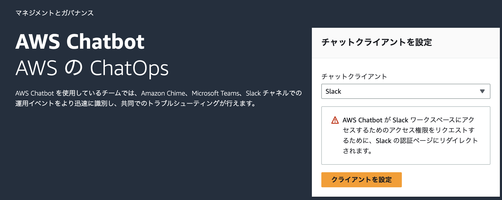
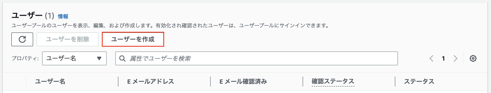
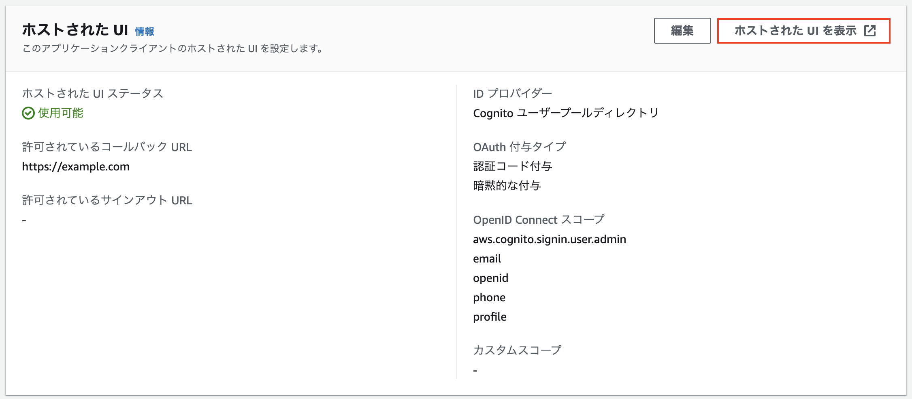

# cognito-advanced-security

Cognito アドバンスドセキュリティを学習するためのパッケージ。

## はじめに

AWS CDK を初めて導入する AWS アカウントに対して、bootstrap を実行します（これは該当の AWS アカウントに対して初回のみ実行する必要があります。実行後は、別の CDK スタックのデプロイで bootstrap する必要はありません）

```bash
yarn cdk bootstrap
```

## 主なコマンド

| コマンド                     | 説明                         |
| ---------------------------- | ---------------------------- |
| [`yarn deploy`](#cdk-deploy) | CDK スタックをデプロイします |
| [`cdk delete`](#cdk-delete)  | CDK スタックを削除します     |

## サンプルを触ってみよう

### Slack ワークスペースの登録（to AWS）

AWS 管理コンソールから AWS Chatbot を開き、自分の Slack ワークスペースとの連携をやっておきます。



連携が成功すると、`ワークスペース ID` が振られるので ID をコピーしておく。

### AWS へのデプロイ

以下のコマンドを実行し、AWS にデプロイします。

```bash
yarn deploy -c slackWorkspaceId=${SlackワークスペースID}
```

### アカウントの作成

AWS 管理コンソールからアカウントを作成する、もしくは以下のコマンドで作成します。

```bash
aws cognito-idp admin-create-user \
--user-pool-id ${任意のユーザープールID} \
--username ${自分のメールアドレス} \
--force-alias-creation
```



### 作成したアカウントでログイン

自分のメールアドレスに仮パスワードを含むメールが届くので、AWS 管理コンソールから、アプリケーションの統合 > アプリクライアントと分析 から CDK で作成したアプリケーションクライアントをクリック。  
ホストされた UI > ホストされた UI を表示 から、メールアドレスと仮パスワードをログインできます。


